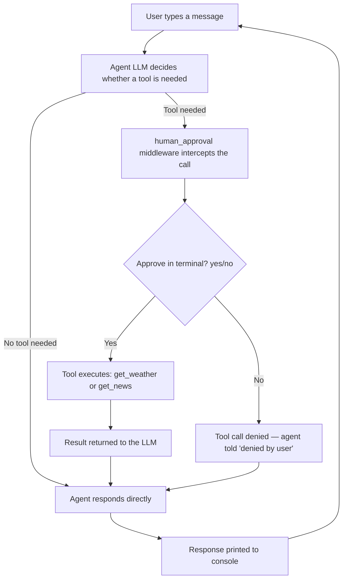

# 🏙️ City Assistant Agent

A small multi-tool conversational agent, built with **LangChain's `create_agent`**, that answers questions about a city's weather and current news — with a **human-in-the-loop approval step** before it's allowed to call any tool.

Unlike a simple prompt → LLM → response chain, this agent **decides for itself** which tool (if any) a question needs, and a human has to explicitly approve each tool call before it executes.

---

## ✨ What it does

- Answers natural-language questions like *"What's the weather in Mumbai?"* or *"What's happening in Delhi right now?"*
- Automatically picks the right tool for the question — weather API, news search, or neither
- **Pauses before every tool call** and asks you (in the terminal) to approve or deny it
- Runs as an interactive CLI chat loop until you type `exit`

---

## 🧰 Tools

| Tool | Source | What it returns |
|---|---|---|
| `get_weather(city)` | OpenWeatherMap API | Current temperature and conditions for a city |
| `get_news(city)` | Tavily Search API | Top 3 recent news results for a city, with title, link, and snippet |

---

## 🧠 Tech Stack

- `langchain` (`create_agent`, agent middleware)
- `langchain-mistralai` — LLM: `mistral-small-2506`
- `tavily-python` — news search
- `requests` — weather API calls
- `python-dotenv` — API key management
- `rich` — formatted terminal output

---

## 🔀 How It Works



The `human_approval` middleware is implemented with LangChain's `@wrap_tool_call` decorator — it intercepts every tool call the agent tries to make, prints which tool it wants to run, and only lets it through if you type `yes`.

---

## 📦 Installation

```bash
git clone https://github.com/Pushkar370/<repo-name>.git
cd <repo-name>

python -m venv venv
source venv/bin/activate        # On Windows: venv\Scripts\activate

pip install -r requirements.txt
```

Create a `.env` file with:

```
MISTRAL_API_KEY=your_mistral_api_key
OPENWEATHER_API_KEY=your_openweathermap_api_key
TAVILY_API_KEY=your_tavily_api_key
```

---

## 🚀 Usage

```bash
python Agents.py
```

```
City Agent | type exit to quit
You : what's the weather in Nashik?
Agent wants to call 'get_weather'. Approve? (yes/no): yes
bot :  Weather in Nashik: clear sky, 29°C
```

---

## ⚠️ Known Limitations

- **Country code is hardcoded** — `get_weather` always queries OpenWeatherMap with `,IN` appended to the city name, so it's currently scoped to Indian cities only.
- **No conversation memory** — each turn sends only the latest message to the agent, not the prior chat history, so the agent can't refer back to earlier turns in the conversation.
- **Approval happens via blocking terminal `input()`** — great for demonstrating the guardrail pattern locally, but this would need to be swapped for a real UI/async confirmation step before this could run as a deployed service.
- Requires three separate API keys (Mistral, OpenWeatherMap, Tavily) to run end-to-end.

---

